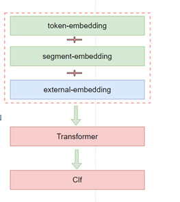
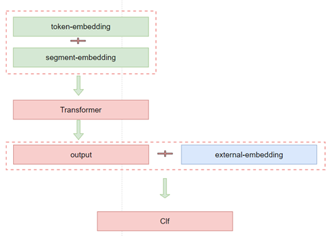
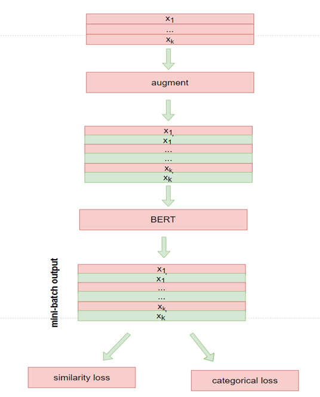
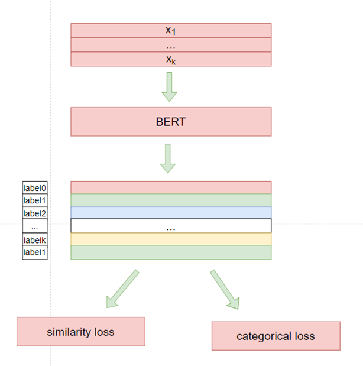
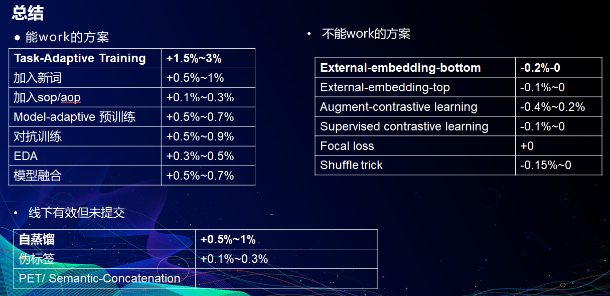
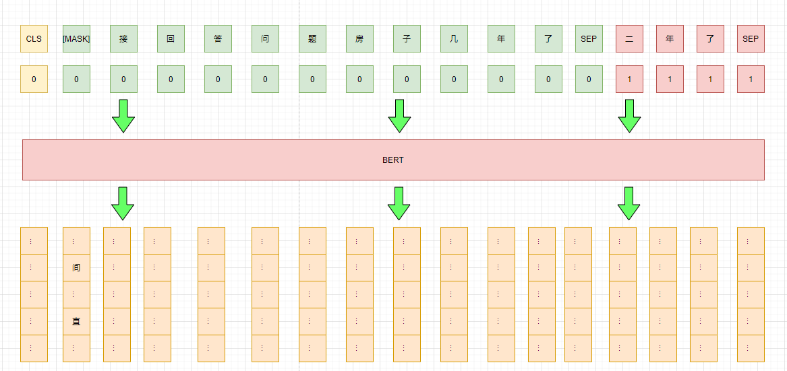
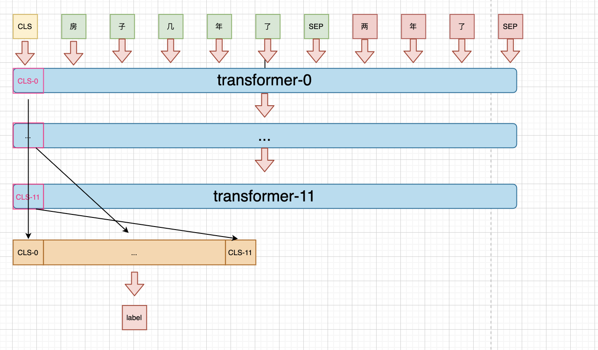

# Update
基于当前repo 优化后，A/B 榜皆是Top1，~~代码整理中，后续会陆续放上来！~~  

<strong>总结博客：</strong>[ccf问答匹配比赛（下）：如何只用“bert”夺冠](https://xv44586.github.io/2021/01/20/ccf-qa-2/)

# 优化思路
## Post training
### mlm
提升mlm任务中的mask策略，提升难度，提高下游性能：挖掘新词，加入词典，whole word mask + dynamic mask
* 挖掘新词
```bash
python new_words_mining.py 
```
### nsp
句子级别的任务是有用的，不过替换为SOP/AOP: query-answer pair时互换位置(sop)，query-answer-list时，只打乱answer-list的顺序（aop)

### model-adaptive
post training的样本格式与下游一致，也能带来提升（区别RoBERTa 中的结论）

完整post training代码为两份：query-answer pair 与 query-answerA-list两种方式：
```bash
python popint-post-training-wwm-sop.py
python pair-post-training-wwm-sop.py
```

PS: post training 后，bert 后接复杂分类层（CNN/RNN/DGCNN/...)基本不会带来提升  


## 融入知识
融入知识主要两种方式：bert 的Embedding层融入与transformer output层融入:
* embedding层融合  

* transformer output 层融合  
  

融入的知识使用的gensim 训练的word2vec(dims=100)，不过两种方式多次实验后都没带来提升：
```bash
python pair-external-embedding.py
```
如何切换融入的方式，请查看代码后自行修改

## 对比学习
引入对比学习尝试提高模型性能，对比学习主要有两种方式：自监督对比学习与监督对比学习：
* 自监督对比学习  
通过互换QA位置，并随机mask 10%的token来构建一对view，view之间互为正例：
* loss  

* model  


* 监督对比学习  
将相同label的样本视为互为正例：
* loss  

* model  


执行自监督对比代码：
```bash
python pair-data-augment-contrstive-learning.py 
```
执行监督对比学习代码：
```bash
python pair-supervised-contrastive-learning.py
```

## 自蒸馏
自蒸馏即Teacher 与 Student 为同一个模型，Teacher训练一次后，在train data上打上soften labels，然后迁移至Student 模型。
```bash
python pair-self-kd.py
```

## 对抗训练
使用FGM方法对EMbedding进行扰动：
```bash
python pair-adversarial-train.py
```

## 数据增强
数据增强主要尝试了两种方式：EDA与伪标签。
* EDA
随机删除/随机替换/随机插入/随机重复，操作比例10%，每个样本生成4个新样本
词向量质量低，所以使用从当前句子随机选取一个词作为同义词进行操作

* 伪标签
用已训练的模型对test data打上标签加入训练集

Tips：
数据增强时用已训练模型进行过滤，将低置信度（<0.7)的样本过滤掉，避免引入错误标签样本；此外，伪标签时，要结合数据比例，过多的测试数据提前进入训练集，最终的结果只会与“伪标签”一致，反而无法带来提升。

## shuffle
在query-answer-list 样本格式下，解码时对answer-list进行全排列，然后投票。不过此次比赛的数据顺序很重要，乱序后结果较差，没带来提升


# 总结


**-----------------------------------2020.01.18------------------------------------------------------------------**

# 比赛
贝壳找房-房产行业聊天问答匹配， 比赛地址[https://www.datafountain.cn/competitions/474/datasets](https://www.datafountain.cn/competitions/474/datasets)

总结博客：[ccf问答匹配](https://xv44586.github.io/2020/11/08/ccf-qa/)

# 简单说明
样本为一个问题多个回答，其中回答有的是针对问题的回答（1），也有不是的（0），其中回答是按顺序排列的。即：
query1: [(answer1, 0), (answer2, 1),...]
任务是对每个回答进行分类，判断是不是针对问题的回答。

# pretrain model weights
预训练模型使用的是华为开源的[nezha-base-wwm](https://github.com/huawei-noah/Pretrained-Language-Model/tree/master/NEZHA-TensorFlow)

# Baseline
## 思路一：
不考虑回答之间的顺序关系，将其拆为query-answer 对，然后进行判断。
比如现在的样本是: {query: "房子几年了", answers: [("二年了", 1), ("楼层靠中间"， 0)]},此时我们将其拆分为单个query-answer pair，即：
[{query: "房子几年了", answer: "二年了", label: 1}, {query: "房子几年了", answer: "楼层靠中间", label: 0}]


代码实现：[pair_match](https://github.com/xv44586/ccf_2020_qa_match/ccf_2020_qa_match_pair.py)

单模型提交f1: 0.752

## 思路二：
考虑对话连贯性，同时考虑其完整性，将所有回答顺序拼接后再与问题拼接，组成query-answer1-answer2，然后针对每句回答进行分类。
上面的例子将被组成样本：{query: "房子几年了", answer: "两年了[SEP]楼层靠中间[SEP]", label: [mask, mask, mask, 0, mask, mask, mask,mask,mask, 0]}
即：将每句回答后面的[SEP] 作为最终的特征向量，然后去做二分类。


代码实现：[match_point](https://github.com/xv44586/ccf_2020_qa_match/ccf_2020_qa_match_point.py)

单模型提交f1: 0.75

## 思路三：
Pattern-Exploiting Training(PET)，即增加一个pattern，将任务转换为MLM任务，然后通过pattern的得分来判断对应的类别。
如本次样本可以添加一个前缀pattern："简接回答问题"/"直接回答问题"，分别对应label 0/1,pattern的得分只需看第一个位置中"间"/"直" 两个token的概率谁高即可。
此外，训练时还可以借助bert的预训练任务中的mlm任务增强模型的泛化能力。更详细的请介绍请查阅[文本分类秒解](https://xv44586.github.io/2020/10/25/pet/)

对于本次样本，对应的示意图如下：



对应代码实现：[pet classification](https://github.com/xv44586/ccf_2020_qa_match/ccf_2020_qa_match_pet.py)

单模型提交f1: 0.76+

# 思路四
由于bert 不同的transformer 层提取到的语义粒度不同，而不同粒度的信息对分类来说起到的作用也不同，所以可以concat所以粒度的语义信息，拼接后作为特征进行分类。

对应于本次样本，示意图如下：


对应代码实现：[concat classification](https://github.com/xv44586/ccf_2020_qa_match/ccf_2020_qa_match_concat.py)
单模型提交f1: 0.75+

# tips
贴几篇感觉有启发的关于文本分类的论文

* [Universal Language Model Fine-tuning for Text Classification](http://arxiv.org/abs/1801.06146)
* [How to Fine-Tune BERT for Text Classification?](http://arxiv.org/abs/1905.05583)
* [Don't Stop Pretraining: Adapt Language Models to Domains and Tasks](http://arxiv.org/abs/2004.10964)
* [Enriching BERT with Knowledge Graph Embeddings for Document Classification](http://arxiv.org/abs/1909.08402)
* [Hate Speech Detection and Racial Bias Mitigation in Social Media based on BERT model](https://arxiv.org/pdf/2008.06460.pdf)
* [Contrastive Self-Supervised Learning](http://ankeshanand.com/blog/2020/01/26/contrative-self-supervised-learning.html)
* [A Survey on Contrastive Self-supervised Learning](http://arxiv.org/abs/2011.00362)
* [Supervised Contrastive Learning for Pre-trained Language Model Fine-tuning](http://arxiv.org/abs/2011.01403)
* [Self-Attention with Relative Position Representations](http://arxiv.org/abs/1803.02155)
* [RoBERTa: A Robustly Optimized BERT Pretraining Approach](http://arxiv.org/abs/1907.11692)
* [NEZHA: Neural Contextualized Representation for Chinese Language Understanding](http://arxiv.org/abs/1909.00204)
* [对抗训练浅谈：意义、方法和思考（附Keras实现）](https://kexue.fm/archives/7234)
* [Train No Evil: Selective Masking for Task-Guided Pre-Training](https://arxiv.org/abs/2004.09733)